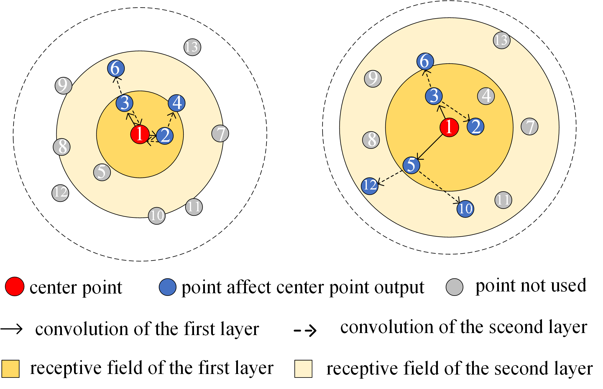
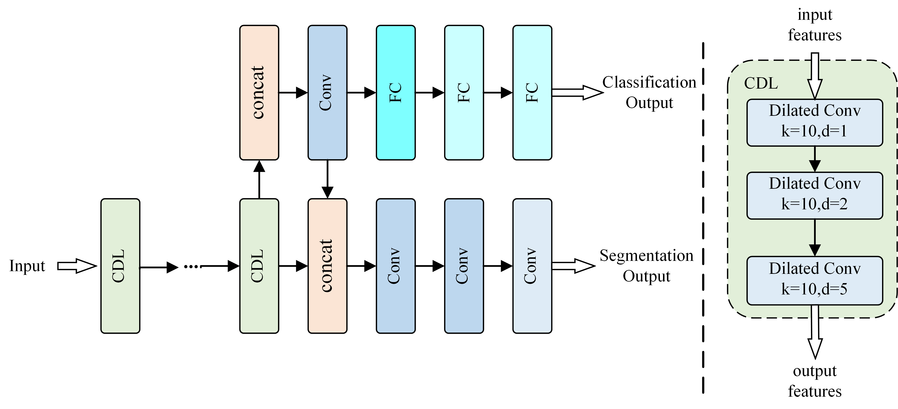

# HDGCN
Point cloud is a kind of data which is tough to process because of its Non-Euclidean structure. Much research have shown that graph convolution is a very suitable model for point cloud analysis including point cloud segmentation, point cloud classification and so on. In this paper, we propose a novel dilated convolution graph convolution model with residual blocks. With hierarchical dilated convolution, our method can expand receptive field without losing the point near the boundary of the receptive field. Our model performs well in many point cloud analysis tasks. The accuracy rates of 93.2$%$, 57.1$%$ and 85.4$%$ were obtained on ModelNet40, S3DIS and ShapeNet datasets respectively. In addition, we made a point cloud grasping dataset, and the experiment shows that our model is also applicable to point cloud application.

In [HDGCN](https://github.com/baiyuxas/HDGCN)，we bring forward a Hierarchical Dilated Graph Convolution Network(HDGCN), using cascade dilated layer(CDL) to avoid gridding problem. Compared with the left image without dilated edge convolution, the right image with dilated edge convolution has a larger receptive field and less feature reuse. In order to evaluate the receptive field, we proposed two criteria (AER$&$MCR) to evaluate the expansion rate of receptive field and the sampling of receptive field edge. A more effective cascade structure is proposed, to make a trade-off between AER and MCR.

The framework of our model is as follows： 

Our code skeleton is borrowed from [WangYueFt/dgcnn](https://github.com/WangYueFt/dgcnn) and [AnTao97/dgcnn.pytorch](https://github.com/AnTao97/dgcnn.pytorch) For more details please contact Anshun Xue.（baiyuxas）

## Classification on ModelNet40
### training 
    python3 main_cls.py --exp_name=cls_1024 --num_points=1024 
### run after training
    python3 main_cls.py --exp_name=cls_1024_eval --num_points=1024 --eval=True --model_path=checkpoints/cls_1024/models/model.t7
## Semantic Segmentation on S3DIS
### training 
    python3 main_semseg.py --exp_name=semseg_5 --test_area=5
### run after training
    python3 main_semseg.py --exp_name=semseg_eval --test_area=all --eval=True --model_root=checkpoints/semseg_5/models/
## Part Segmentation on ShapeNet
### training 
    python3 main_partseg.py --exp_name=partseg 
### run after training
    python3 main_partseg.py --exp_name=partseg_eval --eval=True --model_path=checkpoints/partseg/models/model.t7
